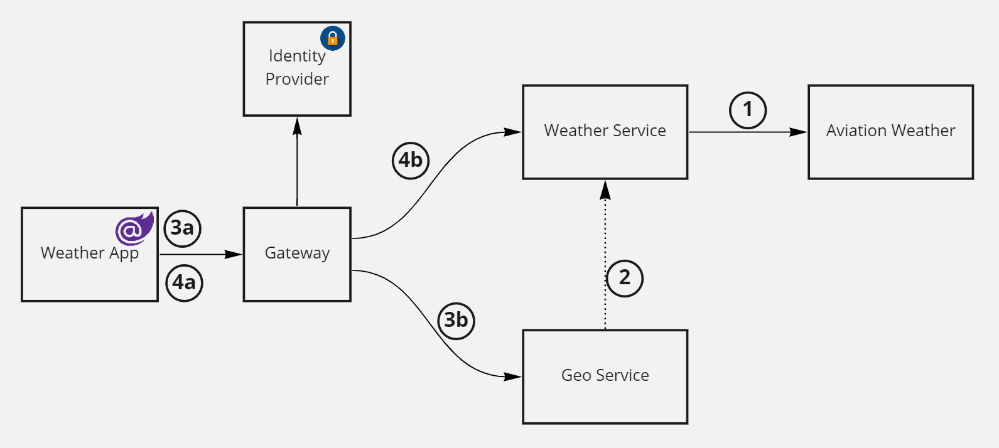

## Weather App

This is a demo app that uses YARP as API gateway to provide an implementation of Backend for Frontend pattern (BFF). It applies a unique security architecture where the gateway itself is a token issuer for backend service, allowing fine grained control of security context when it reaches backend apps. This offers a concrete solution for a common scenario where external identity provider does not bring in all the required security information needed to make app specific authorization decisions (ex. ADFS used to identify users, but roles are managed at the app level). 

## Understanding the sample

Weather service downloads an XML of publicly available airport and aviation weather data (METARs). The XML is parsed, and weather service offers two main methods: get airports and their latitude / longitude and lookup weather by airport code.

Geo service provides downloads a list of airports and their coordinates from weather service and exposes API that using geospatial library able to lookup the closest airport for a given lat/lon location anywhere in the world. 

The frontend is implemented as a Blazor app. Certain weather attributes are only available to premium users (windspeed, humidity, cloud cover). 

An BFF gateway is built using YARP that secures certain routes to be accessible only by logged in users. Logged in users are issued a cookie for the frontend. The gateway proxies requests from frontend to the backend, but converts claims in cookie context into short lived JWT tokens.  

The system uses mock identity provider based on IdentityServer4 to simulate external authentication provider. The gateway causes redirect to authenticate, and when the user is logged in it "enriches" security principal with additional claims to identify if the user is a premium user. 

This architecture has a number of advantages

- It is easy to implement
- It solves the issue of shaping security context for LOB authorization model without having to roll out a full OIDC server
- Tokens are very short lived and are meant for single request, minimizing security risk if they ever leak
- Simplified bootstrap of microservices - they obtain JWT signing key from gateway OIDC discovery endpoint
- Since tokens are issued on every request, complexity associated with token management, expiry, refresh is removed from the apps
- Cookies authentication is easier to implement on front end, and easy to deal with sliding session expiration
- Much of security complexity is pushed out of the apps and into the gateway, which can be centrally managed by few developers who are more versed in implementing security in apps

Some downsides of this approach

- Since gateway is application specific, it's not a good approach for building true API gateway that acts as catalog of API domain services across teams
- Issuing token on every request has negative performance impact which may affect scalability
- This flow is not considered "standard"